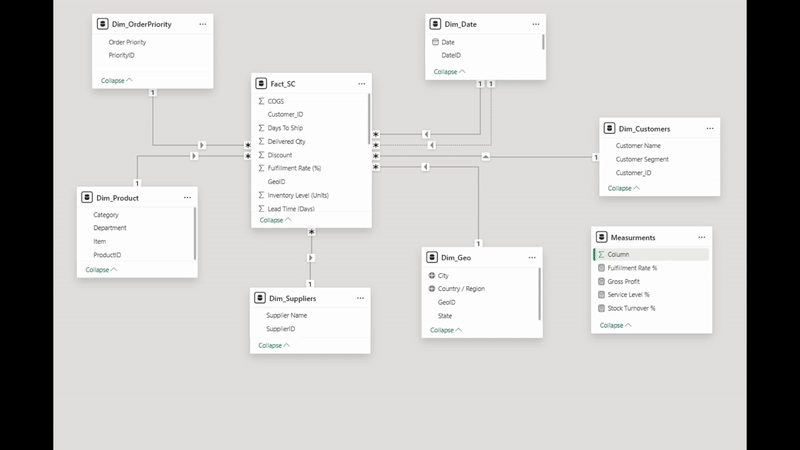

Developed a comprehensive Power BI solution providing a 360° view of sales performance, operational efficiency, customer service levels, and inventory management.  
Integrated data from multiple business functions sales orders, shipping, and inventory to deliver actionable insights and support data-driven decisions.  
Applied Data Modeling and DAX Calculations Focused on key KPIs including Profit, Fulfillment Rate, Service Level, and Stock Turnover, with dynamic filtering by region, product category, customer segment, and supplier.  
Empowered management to identify growth opportunities, optimize logistics, and improve end-to-end supply chain performance.

